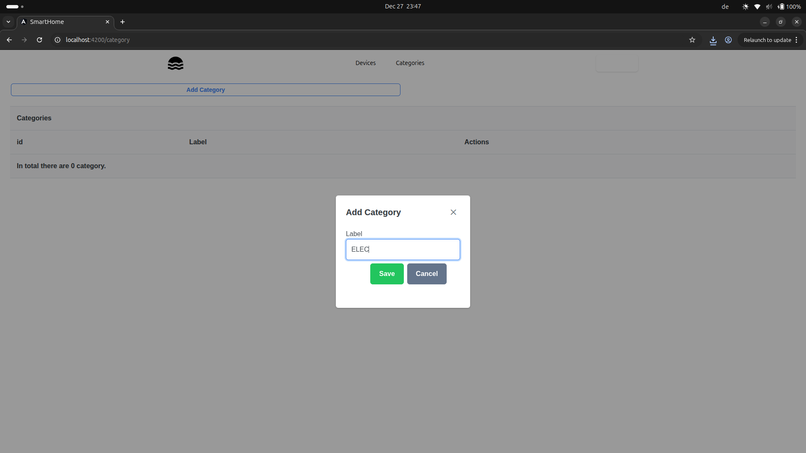
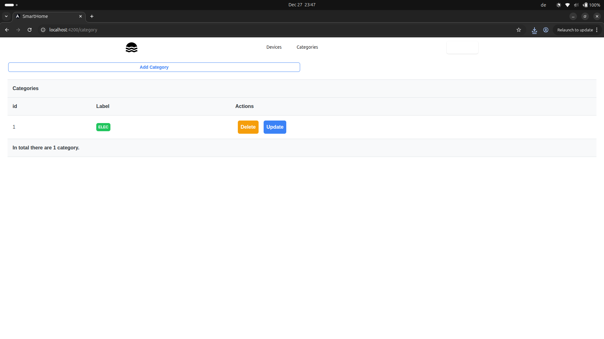
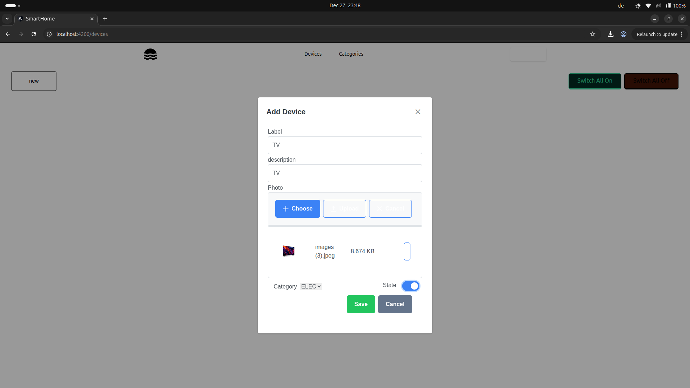
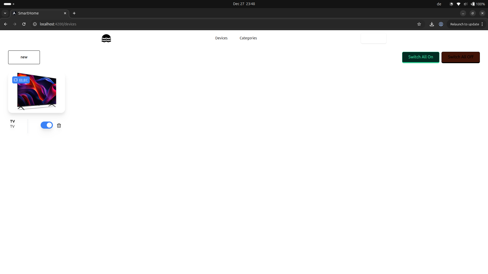
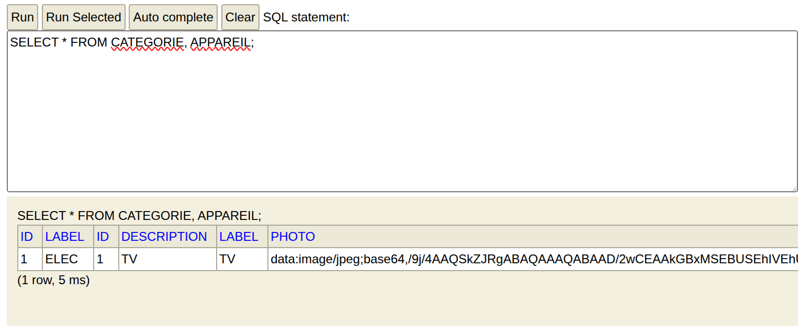

# SmartHome Full Stack

A SmartHome management exercise with an interface for categories and connected devices, plus relational data access.

## Demonstrated features

- Category management UI
- Device management UI
- Device image import in the demonstrated form
- Device state display
- SQL querying across category/device data

## Screenshots

## Coursework

This repository is included as a full-stack coursework project; screenshots are retained as evidence of the demonstrated functionality.
